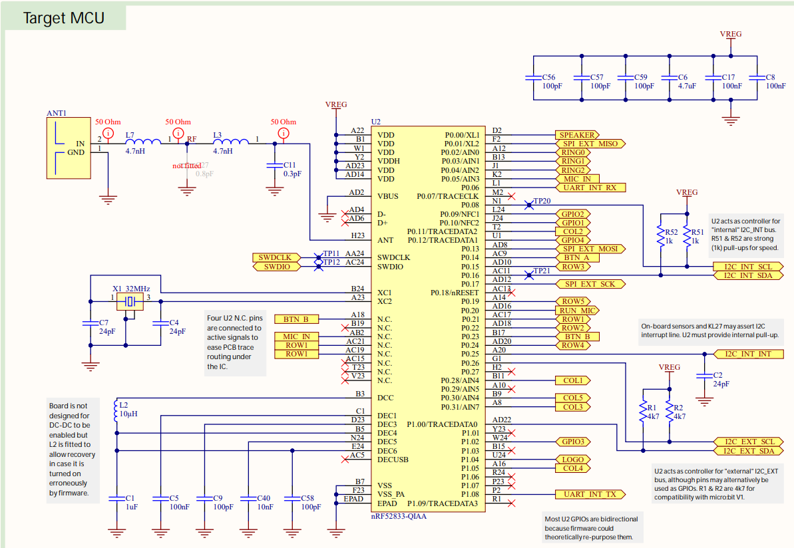
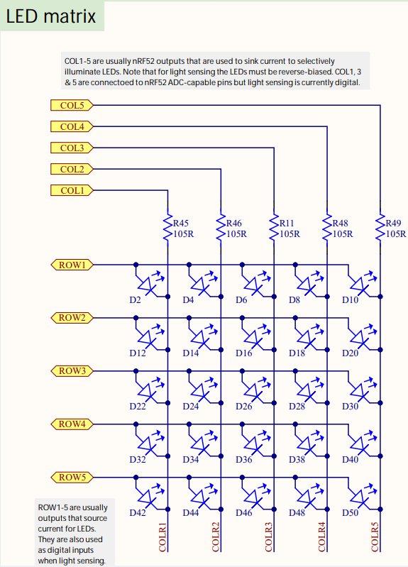
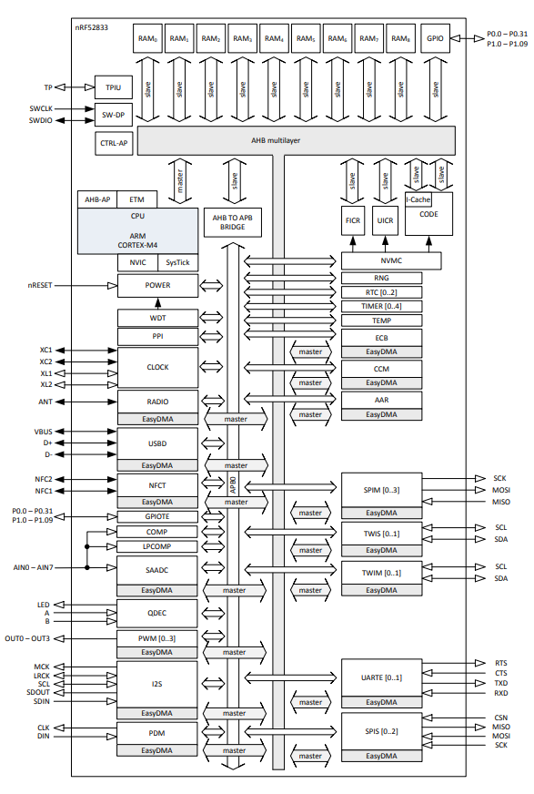

# What is Micro:bit?

The highlights of Micro:bit V2 [schematics](https://github.com/microbit-foundation/microbit-v2-hardware/blob/main/V2.00/MicroBit_V2.0.0_S_schematic.PDF):

The NRF52833 diagram from [the manufacturer](https://infocenter.nordicsemi.com/index.jsp?topic=%2Fstruct_nrf52%2Fstruct%2Fnrf52833.html&cp=3_1):

